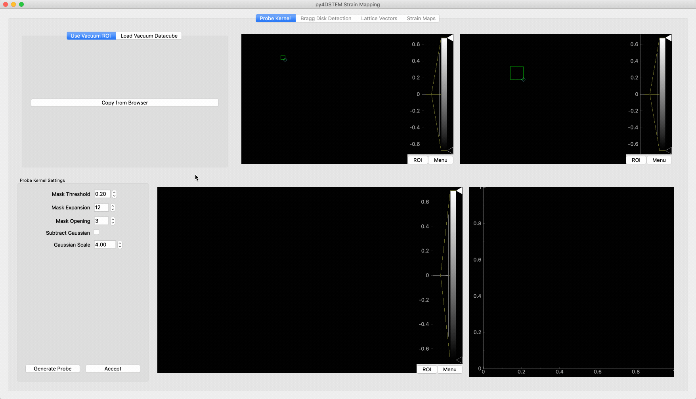
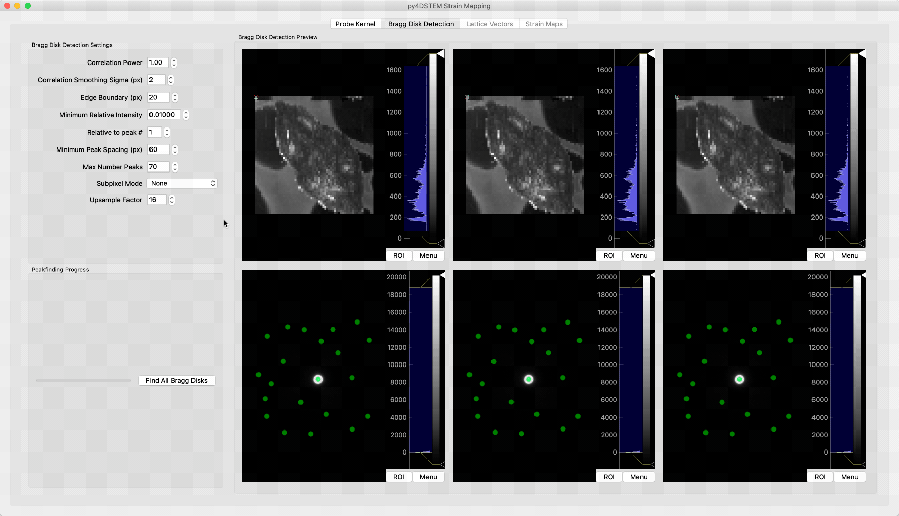
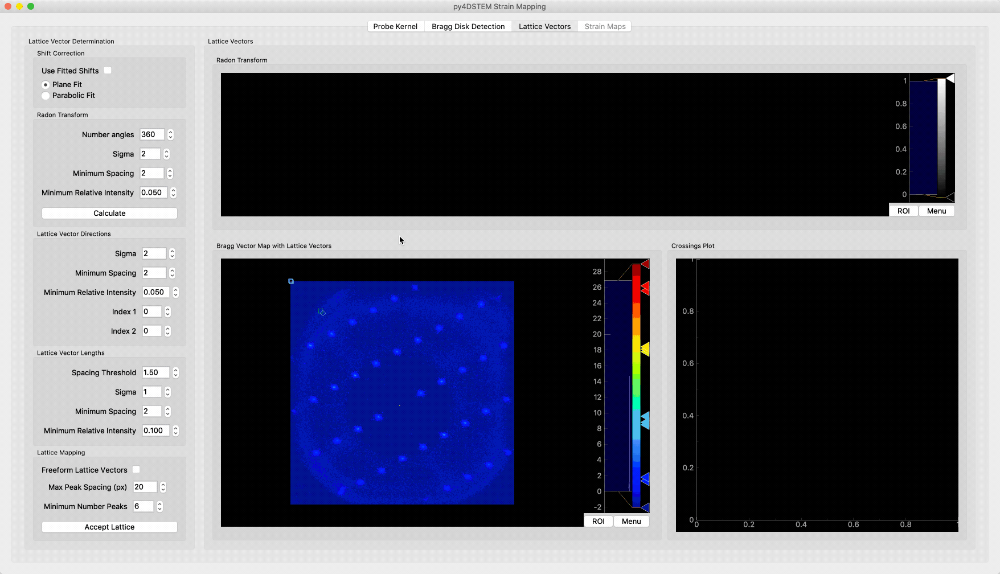
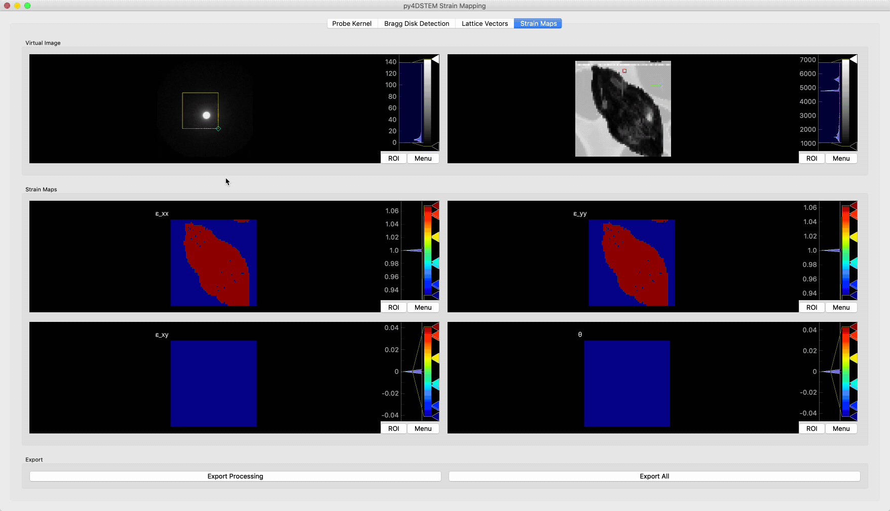

# Interactive Strain Mapping with py4DSTEM

First, load a datacube using the Browser window. Set the scan shape, if needed. If the data is larger than the RAM available, load it as a memory map and use binning to make the data smaller (this will also load the binned stack into RAM so choose the bin factor wisely). 

Launch the `Single Crystal Strain` tool.

## Find Probe Kernel

The probe kernel is the "template image" used in finding the Bragg disks. It's important that the probe kernel be as similar to the experimental disks as possible, so ideally we find it by averaging several probes through vacuum. 

The two views in the top pane are linked just as in the Browser: the ROI on the diffraction pattern defines the virtual detector for the image on the right. The DP displayed is averaged over the realspace ROI chosen on the virtual image. 

### Load data and crop in diffraction and real space

* **If your scan area contains vacuum** and the vacuum probe is not saturating the detector, choose `Use Vacuum ROI`. Move the ROI on the virtual image over the vacuum region, and move the ROI on the diffraction pattern (DP) over the vacuum beam.
* **If you have a separate vacuum scan** choose `Load Vacuum Datacube`. In this window, you must choose the binning before you click `Browse` to open the datacube. It is important to choose the same binning used for the main datacube. Set the scan shape. Move the DP ROI over the vacuum beam and move the virtual image ROI over the entire scan region.
* **If you do not have a vacuum scan; if you do not have a vacuum region; or if your vacuum region has saturated/bloomed the detector** then choose `Use Vacuum ROI`, pick an ROI on the virtual image, and place the DP ROI around *one* of the scattered beams. 

Note that the larger the region in real space you select, the longer the calculation takes. You usually need only 10-20 scan spots. 

### Choose parameters
* `Mask Threshold` defines the cutoff, relative to the brightest pixel, for masking the probe.
* `Mask Expansion` defines how many pixels out from the thresholded limit to expand the mask.
* `Mask Opening` defines sets the number of iterations of a binary opening operation that eliminates stray bright pixels.
* `Subtract Gaussian` sets whether a Gaussian is subtracted from the background of the probe image. When the diffracted disks are far from one another, this option helps reject false peaks and improves precision. When the tails of the Gaussian are likely to overlap neighboring Bragg disks, (i.e. the Bragg disks are nearly touching) then this option should be left off. 
* `Gaussian Scale` defines the standard deviation of the subtracted Gaussian function. Lower values lead to sharper and more negative dips around the probe, while large values spread out the negated region. Only used when `Subtract Gaussian` is enabled.

Press `Generate Probe` to test the settings. Once generated, the probe is displayed in the image box, and a line trace through the center is displayed in the plot. When you are happy with the probe kernel, press `Accept`. Shifting to the origin is performed automatically and not displayed. The **Bragg Disk Detection** tab becomes enabled. 

## Bragg Disk Detection

### Choose test regions
The three realspace views each have a point ROI, which is used to select the diffraction patterns for testing the peakfinding parameters. The image is defined by the virtual detector in the main Browser window, and will update if the virtual detector there is changed. Changing any of the parameters in the control panel will auto-update the Bragg disks.

### Choose parameters
* `Correlation Power` is the Fourier correlation coefficient, which sets whether the correlogram is found via cross-correlation (1), hybrid correlation (0&lt;p&lt;1), or phase-correlation (0). Normally 0.9-0.95 provides the best results. When using a patterned probe, always use p=1. Adjust this by observing how the Bragg disk markers align with the centers of the disks, maximizing how well centered they are. Adjusting this will change how many peaks are detected: ignore this for now, and correct it later with the thresholds.
* `Correlation Smoothing Sigma` sets the width of the Gaussian blur applied to the correlogram. Increasing this helps reject false peaks caused by noise, but at extreme values the disk registraion precision will suffer.
* `Edge Boundary` defines a region around the sides of the DP to reject peaks. Peaks that are cut off the by the edge of the detector or the HAADF should be excluded. A good guess is to set this to the width of a Bragg disk.
* `Minimum Relative Intensity` is the main thresholding parameter. Peaks less than this fraction of the *(n+1)*th brightest peak are cut off, where *n* is set by `Relative to peak #`. 
* `Minimum Peak Spacing` sets the minimum distance between neighboring peaks. The brighter of the too-close peaks is retained. Set this to roughly the smallest distance between Bragg peaks, and tune to reject as many intermediate peaks as possible. 
* `Max Number Peaks` does what it says on the tin.
* `Subpixel Mode` sets the type of subpixel refinement performed on the peaks. This is not active on the previews, which always use **None**. **Parabolic** mode incurs almost no speed penalty but is not very accurate. The ideal choice is **Upsample DFT**, which upsamples the correlogram in a local, efficient manner by a factor specified in `Upsample Factor`. Values of 16-64 are reasonable, with higher factors giving more precision. At 16, the peakfinding takes approximately 3 times longer than **Parabolic**. 

### Find all Bragg Disks
Once the parameters are set, press `Find All Bragg Disks` to begin the peakfinding progress. The GUI will likely become sluggish (as will your whole computer to be honest). If the progress bar appears stuck, check the console. If the peakfinding failed, update the parameters and try again. When the peakfinding successfully completes, the **Lattice Vector** tab will become enabled. 

## Lattice Vector Determination

First, select the mode for shifting of the diffraction patterns to correct for the descan. By default, the raw shifts are used. If the data has large shifts this may fail. If you want to preserve the DPC-esque signal the comes from the shits, check `Use Fitted Shifts`. Otherwise it is safe to leave this panel alone.

Next, move the rectangular ROI on the Bragg Vector Map so that it encompasses *only* the direct beam. This serves two purposes: the ROI is the mask for the Radon transform automatic lattice vector algorithm, and the pattern center is located as the brightest pixel inside the ROI. Press `Calculate` in the Radon Transform tab. 

The detected lattice vectors will display on the Bragg Vector Map, and the points will indicate all the lattice positions that will be used. If the lattice vectors/points do not match up with the lattice, you have two options: (i) tune the parameters for the auto ID algorithm or (ii) use the freeform mode. Recommendation is to adjust `Index 1` and `Index 2`, as this is often enough to fix the auto ID guess. If that doesn't work, finding good auto ID parameters is hard and it's better to check `Freeform Lattice Vectors`. This will allow you to drag the vectors on the Bragg Vector Map to pick a better lattice. *Note: the green dots are the lattice points that will be used. If you drag the vectors without checking the freeform box, the auto ID'd points will still be used.*

Next, we choose settings for the lattice vector mapping:
* `Max Peak Spacing` sets the threshold for excluding a detected Bragg disk from the lattice calculation. You can get a good value by observing how wide the blur around the lattice points on the Bragg Vector Map spans.
* `Minimum Number Peaks` is the minimum number of Bragg disks that fall inside the `Max Peak Spacing` threshold that needs to be present to calculate a lattice. Patterns where this threshold is not met will be blacked-out in the strain map.

Once these parameters are set, press `Accept Lattice`. The strain in each pattern will be found and the maps will become available in the Strain Maps tab.

## Strain Mapping

In the top row of the strain map tab there are three important controls:
* The ROI on the diffraction pattern sets up the virtual image
* **The rectangular ROI on the virtual image defines the reference region for zero strain.** The median lattice vectors inside this region are taken as the zero-strain lattice. (Calibration of the strain can only be done later outside the GUI.)
* The point ROI on the virtual image chooses a diffraction pattern. 

There are two options for exporting the results:
* `Export Processing` saves only the processing data: the probe kernel, the Bragg disk PointLists, the Bragg Vector Map, the lattice vectors, the lattice vector map, and the strain map. *If you choose an existing py4DSTEM h5 file in the Save menu, this data will be appended, and the datacube and any objects inside will be preserved.* 
* `Export All` saves all the above processing, in addition to a copy of the DataCube, in py4DSTEM format. (Note, the vacuum datacube is not saved.)
